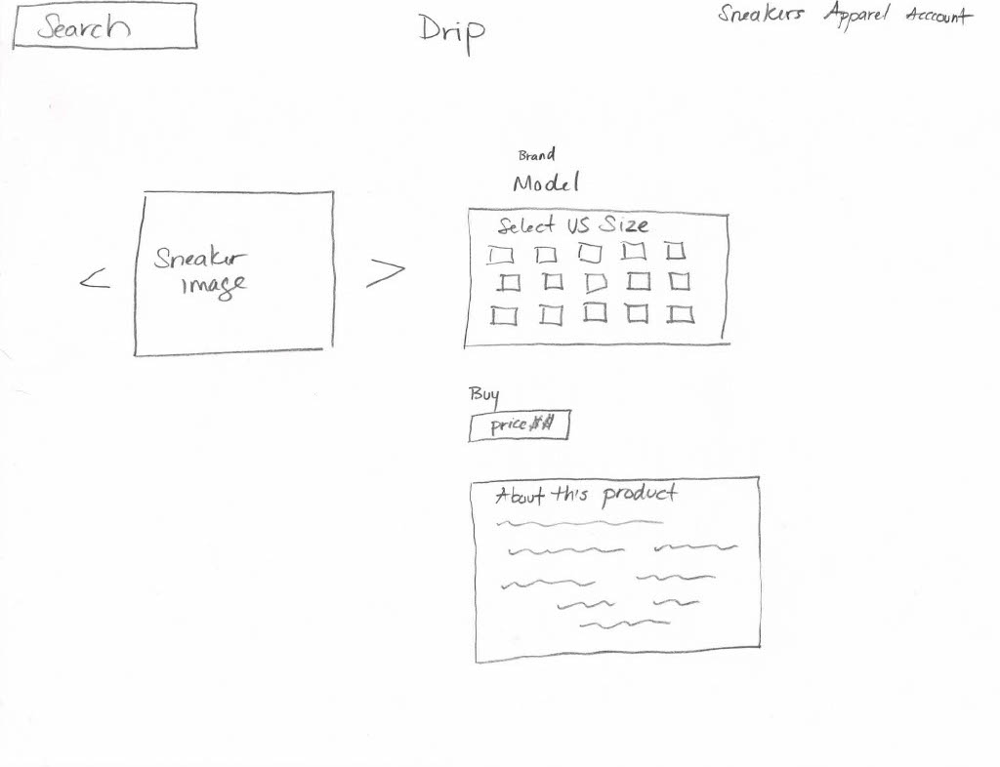
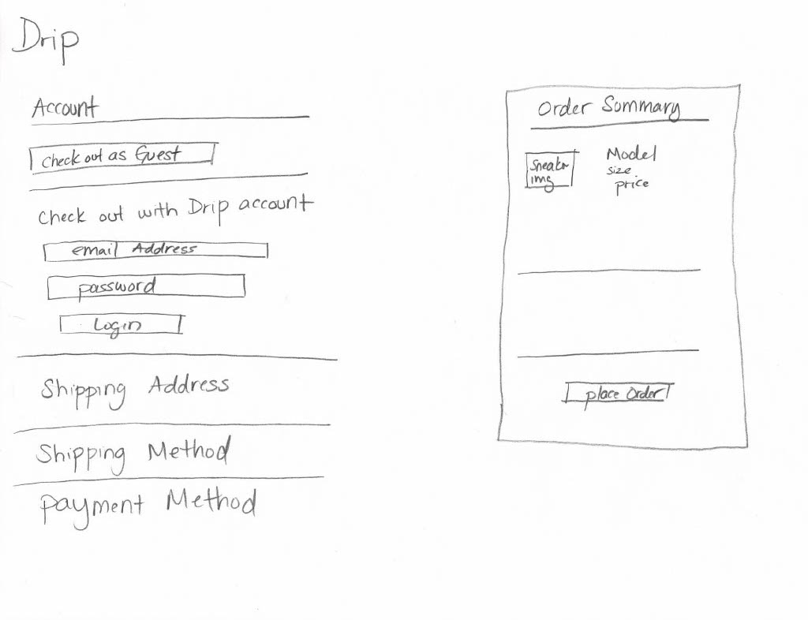

# Drip

## GA Capstone Frontend

### About Drip
A sneaker retail consignment store for rare shoes. Carrying the rarest exclusives and collectible sneakers. 

#### Planned Technologies Used
- HTML
- CSS
- JavaScript
- Gatsby
- Stipe
- Netlify
- Trello

#### Routes & Components 
- App --> Header 
- App --> Outlet 
- Outlet -- "/" --> Index
- Outlet -- "/shoe/:id" --> Show
- Outlet -- "/checkout" 

#### User Auth Routes (Admin)
- Outlet -- "/show/create" --> createAction
- Outlet -- "/show/update/:id" --> updateAction
- Outlet -- "/shoe/delete/:id" --> deleteAction

#### Database Schema

#### Website Images

### Link to Planning Trello Board
[Trello Board](https://trello.com/invite/b/pv2WzSAP/ATTIba92e98f9914321d38ef5c5349df46ad7E13F8D6/capstone)

### Link to Frontend
[Live Site]()